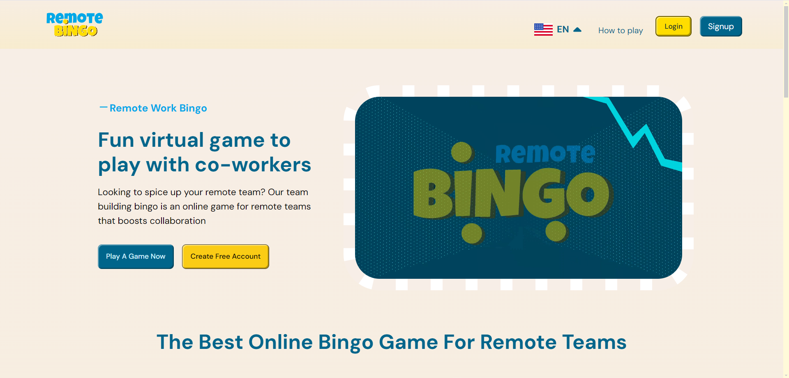

# End-2-End Tests for Bingo FE

#### TABLE OF CONTENTS
- [Overview](#overview)
- [Prerequisites](#prerequisites)
- [Installation](#installation)
- [Running the Tests](#running-the-tests)
  - [Using Cypress UI](#using-cypress-ui)
  - [Using the Command Line](#using-the-command-line)
- [Test Coverage](#test-coverage)
- [Contributions](#contributions)
- [License](#license)


## Overview
This repository contains end-to-end (E2E) tests for the Bingo app using Cypress. The test suite verifies several pages including the core UI elements, authentication buttons, game actions, and footer links to ensure smooth functionality.
<div align="center">

</div>

## Prerequisites
- Node.js (latest stable version recommended)
- npm or yarn installed
- Cypress installed

## Installation
To run this project, follow these steps:
- Clone the repository:
    
  git clone https://github.com/paulinebanye/remote_bingo_E2E.git
- Navigate to the project folder:
- Install dependencies:
  ```
  npm install
  ```

## Running the Tests
You can run the tests in two ways:
- ### Using Cypress UI
  To run the tests in the Cypress Test Runner, use the following command:
  ```
  npx cypress open
  ```
  This opens the Cypress Test Runner, allowing you to run tests interactively.

- ### Using the Command Line
  To run the tests in the command line, use the following command:
  ```
  npx cypress run
  ```
  This runs all tests in the command line without opening the Cypress UI (aka headless mode)


## Test Coverage
This project contains the End-2-End tests for the following pages and APIs:
<details>
  <summary>
    <strong>
      Pages
    </strong>
  </summary>

  - About us page
  - Game page in alphabet mode
  - Contact us page
  - How to play page
  - FAQ page
  - Homepage
  - How to play page
  - Join game page
  - Login page
  - Game page in number mode
  - Privacy policy page
  - Signup page
  - Terms of service page
  - Game room page
  
  <!-- <div> -->
</details>
<details>
  <summary>
    <strong>
      APIs
    </strong>
  </summary>
  
  - Blog API
  
  <!-- <div> -->
</details>


## Contributions
Feel free to submit pull requests for additional tests or improvements.

## License
This project is licensed under the MIT License.
